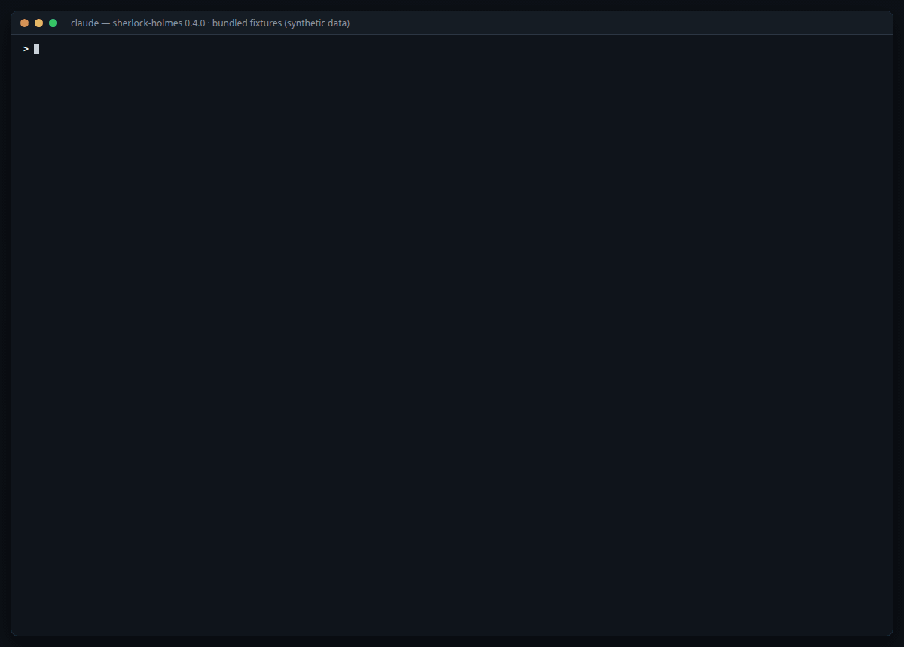

# Sherlock Holmes

Evidence-first incident investigation by trace ID, for Claude Code. Give it a trace ID; it collects the trace from **Grafana Tempo** and the log lines from **Grafana Loki**, rebuilds the timeline, finds the first anomalous event, separates cause from consequence, and tells you how confident it is and what the evidence cannot show.

It is **read-only**. It never modifies production, dashboards, alerts or code.

Four skills, one rule - facts come from deterministic scripts, and a model runs only when you ask for
an investigation:

| Skill | The question it answers | Model? |
| --- | --- | --- |
| `/sherlock-holmes:trace-debug <trace-id>` | Why did this request fail, hang or slow down? | Yes - the forked investigator agent |
| `/sherlock-holmes:error-sweep --last 2h` | Were there errors in this window? Where, how many, since when? | No - a script prints the table |
| `/sherlock-holmes:trace-diagram <trace-id>` | What did this trace do - who called whom, where did the time go? | No - a script draws it |
| `/sherlock-holmes:setup` | How do I wire this to my Grafana? | No agent - a guided checklist |

```
/sherlock-holmes:trace-debug 4bf92f3577b34da6a3ce929d0e0e4736
```

## What you get

```
# Trace investigation
**Trace:** ...  **Services:** api -> payment-service -> customer-service
**Sources:** tempo=found loki=9 lines, window 14:02:01-14:03:03 (bounded by tempo)
**Diagram:** diagram: generated /tmp/trace-debug/<trace-id>.html (6 messages; evidence only)

## Diagnosis            two to four sentences
## Timeline             the lines that matter, gaps noted
## First anomalous event
## Causal chain         first anomaly -> ... -> final symptom, one evidence type per link
## Probable cause       labelled FACT / INFERENCE / HYPOTHESIS
## Confidence           HIGH | MEDIUM | LOW, one sentence why
## Evidence
## What the evidence does not show
## Next checks          at most three
```

The core rule: **never prefer a convincing story to incomplete evidence.** "There is not enough evidence to determine the root cause" is a valid answer, and the agent is built to give it.

## See it in action

A sweep of a time window, the map of its calls explored in the browser, the sequence diagram of the
first row's trace, then the investigation of the same trace - real output of 0.5.0 on the bundled
`cascade` fixture (synthetic data):



Install to finished report, recorded end to end:

<video src="https://github.com/user-attachments/assets/2d406d94-b4ab-4938-a90a-016d639c8e3a" controls width="700"></video>

## How it works

```
trace id
   |
   v
collect-trace.py  (deterministic, read-only, stdlib Python)
   |  1. Tempo  GET /api/traces/<id>      -> span tree, bounds the time window
   |  2. Loki   query_range |= "<id>"     -> log lines inside [start-pad, end+pad]
   |  3. normalise, join logs<->spans, dedupe, mark truncation, derive facts
   v
compact "prompt cut" + full JSON on disk
   |
   v
sherlock-holmes agent (forked subagent, opus)
   |  timeline -> first anomaly -> hypotheses -> elimination -> causal chain
   v
report with confidence and gaps
```

The files that do the work:

| File | Role |
| --- | --- |
| `skills/trace-debug/scripts/collect-trace.py` | Collects the facts of one trace. Never decides a cause. |
| `skills/trace-debug/scripts/sweep-errors.py` | Lists the errors of a time window, grouped and ordered by a fixed rule. No trace id needed. |
| `skills/trace-debug/scripts/trace-diagram.py` | Draws a collected trace as a sequence diagram (archify). Evidence only. |
| `skills/trace-debug/scripts/window-map.py` | Draws every call recorded in a window's error traces as one aggregated sequence diagram. |
| `skills/trace-debug/SKILL.md` | The investigation: how to collect, the protocol, the report format. |
| `skills/error-sweep/`, `skills/trace-diagram/`, `skills/setup/` | The three model-free skills around the scripts. |
| `agents/sherlock-holmes.md` | The investigator: identity, rules, prohibitions, confidence rubric. |

Only `trace-debug` runs an agent. The sweep and the diagram are the same kind of tool as the
collector: deterministic, read-only, the same input gives the same output.

Why Tempo first? A trace ID carries no timestamp. Looking a trace up by ID in Tempo is indexed and cheap, and it returns the exact start and end, so the Loki query can be tight instead of scanning hours of every stream. The agent still *reads* logs first; only the collection order is Tempo-first. When Tempo does not have the trace (unsampled, unexported, expired), the collector says so and falls back to a lookback window, or to `--around` / `--start` `--end` if you know roughly when it happened.

## See the trace as a diagram

When Tempo returns the trace, the investigation also draws it: one self-contained HTML file with the
services as participants, every outbound span as a call and its return (recorded start, end, status
and duration), SERVER spans as activations, and the warn/error log lines the collector joined to a
span as notes on the matching message. Open it in a browser and send it around; nothing else is
needed to view it. `/` finds a participant, `R` traces a route between two of them, `P` plays the
guided chapters ("Request path", "First span to fail"), and Export gives PNG or SVG.

Colour carries the outcome, read from the span, and a legend under the diagram names each one. A call
is neutral grey. Its return is **red** when the span has error status or a 5xx code, **amber** for a
4xx without error status (an error for the caller, not necessarily for the server, as OpenTelemetry
puts it), and plain when it went well. A service whose SERVER span has error status gets a red
activation bar, and the "first span to fail" card is marked red too. Queue sends and deliveries stay
dashed violet.

It is **evidence only**. A deterministic script builds it from the spans as recorded; the agent
never authors it, no cause is drawn, and the "first span to fail" chapter says so in its own note:
being first is a fact, being the cause is the investigator's call. Labels come from an allowlist of
span attributes (operation, method, route, status code, peer name, `db.system`), so `db.statement`,
URLs with ids and headers never reach the file. The report carries a `**Diagram:**` line with the
path, or the one-line reason when none was generated.

Rendering uses [archify](https://github.com/tt-a1i/archify) (MIT), an optional dependency: Node 18+
and the archify skill, installed once with

```bash
npx skills add tt-a1i/archify -g        # or: export ARCHIFY_BIN=/path/to/archify/bin/archify.mjs
```

Without it the investigation is exactly the same, minus the file. `Run the trace-debug doctor`
reports `diagram: available` or the reason it is not. The archify update check is disabled for
every call: the plugin still talks only to Loki and Tempo.

To draw a trace without investigating it - to look at it, share it or export it, with no diagnosis -
use the lighter skill, which runs no agent:

```
/sherlock-holmes:trace-diagram 4bf92f3577b34da6a3ce929d0e0e4736
```

### Exploring a diagram

The trace diagram and the window map are the same kind of file, and everything below works offline in
any browser - it is the [archify](https://github.com/tt-a1i/archify) viewer, not the plugin:

| Control | What it does |
| --- | --- |
| Click a service | Its *passport*: upstream and downstream services and the calls recorded between them |
| Click an arrow | The call it stands for, pinned and highlighted |
| `/` or the search icon | Find a service by name |
| **PATH** | Pick two services; the viewer shows the recorded route between them (never inferred from layout) |
| **MAP** | Semantic radar: a thumbnail of the whole diagram, click to jump |
| **LENS** | Compare roles - backends, databases, queues - and dim the rest |
| Chapters / `P` | The guided views the script wrote ("Request path", "First span to fail", "Calls with error status"), step by step |
| Style menu | Classic, Signal Flow, Blueprint, Editorial - same content, different look |
| Theme, **Present**, **Export** | Light/dark, a presentation stage, PNG/SVG/WebM and share cards |

None of these change what the diagram says: they are ways of reading the same recorded facts.

## Sweep a time window for errors

No trace id yet, just a question - "any errors in the last two hours?" - ask for a sweep:

```
/sherlock-holmes:error-sweep --last 2h --service payment-service
```

A script, not a model, answers it: one Tempo search for spans with error status and, when Loki is
configured, one query for error lines. It prints a numbered table - service, operation or message
signature, count, traces, first and last seen, example trace ids - grouped so that one failure mode is
one row (numbers, ids, UUIDs, IPs and e-mails in messages are masked; `returned 503` keeps its code).
The order is a fixed rule, count then first seen; there is no severity column and no cause. A footer
says what the data cannot show: unsampled requests, late ingestion, search limits (a limit hit makes
the counts a floor, and the table says so). The same window gives the same table.

Then you choose what to spend on: `diagram 3` draws the first example trace of row 3 (no model),
`map` draws the whole window (below), and `investigate 3` hands row 3's trace to `trace-debug`, the
only step that runs the agent. Rows your team already
knows can be listed under `## Known errors` in the priors file: they are marked `known`, never
hidden. Three recorded scenarios ship with the plugin - ask for the sweep of the bundled `cascade`,
`timeouts` or `silence` fixture.

### The window map

`map` downloads the traces that had an error span in the window (the newest 50 by default) and draws
every call they recorded as one sequence diagram: services are the columns, and each kind of call -
caller, callee, operation with ids masked - is one arrow labelled `4× POST /charge · 4 err 502`, in
order of first occurrence. An arrow is red when any of its calls had error status; the legend says so. It answers "who called whom in this window, how often, how often with an
error", for all rows at once. Cards say what the map cannot show: callers outside the traces, sampled
traces Tempo did not return, errors inside a service with no call, and that calls from error-free
traces are not in it. A sequence, not a node-and-edge graph, because it is laid out by rule - the
script stays deterministic (decision D22).

## Quick setup

Six steps from nothing to a real investigation, plus an optional seventh for the diagram. Steps 1 and 2 need no Loki and no Tempo.
Requirements: Claude Code and Python 3.8+ (Node 18+ only for the optional diagram).

Or let the plugin guide you: after step 1, run

```
/sherlock-holmes:setup
```

It does steps 3 to 7 in one conversation - checks access with the doctor, finds the datasource UIDs,
proposes the selector from the labels your Loki really has, hands you the exact `/config` values, and
offers to install archify (only after you say yes). The two things it cannot do for you are export the
token and fill `/config`: those stay yours, by design of the plugin system.

**1 — Install.** In Claude Code:

```
/plugin marketplace add whitebeardit/claude-plugins
/plugin install sherlock-holmes@whitebeard-plugins
```

If the install summary says `Run /reload-plugins to activate.`, do that. The install dialog asks
for your Grafana URL, two datasource UIDs and a stream selector — leave them blank for now: steps 4
and 5 are how you find those values, and `/config` edits them later.

**2 — Watch a full investigation, offline.** Ask Claude:

> Investigate trace `2aa803b2e40c97a2490d754a465fe9de` using the bundled fixtures for
> `01-downstream-503`.

Recorded Loki and Tempo responses ship with the plugin, so this works before anything is wired up.
[Five more scenarios](#try-it-without-a-loki-or-a-tempo) are bundled.

**3 — Point it at your Grafana.** Create a service account token (*Administration → Users and
access → Service accounts*; Viewer is enough, the plugin only reads). Export both variables in the
shell that launches Claude Code, then restart Claude Code so the collector inherits them — [the
token deliberately is not in the install dialog](#configure):

```bash
export GRAFANA_URL=https://your-stack.grafana.net    # or your self-hosted Grafana
export GRAFANA_TOKEN=glsa_...
```

**4 — Ask the doctor for your datasource UIDs.** Ask Claude:

> Run the trace-debug doctor.

With only the URL and the token set, it lists every Loki and Tempo datasource it can see, with
their UIDs. You don't have to hunt for them in the UI.

**5 — Set the UIDs, then build the selector.**

```bash
export GRAFANA_LOKI_UID=<uid from step 4>
export GRAFANA_TEMPO_UID=<uid from step 4>
```

Ask for the doctor again. It now returns `check: ok` for both sources, plus a sample of the label
names your Loki actually uses. Build the selector from that sample — not from this README, your
labels are almost certainly different:

```bash
export LOKI_SELECTOR='{namespace="your-namespace"}'
```

**6 — Investigate a trace you already understand,** so you can judge the answer:

```
/sherlock-holmes:trace-debug <trace-id>
```

**7 — Optional: the diagram.** Install [archify](https://github.com/tt-a1i/archify) once (Node 18+;
this also installs its `archify-review` companion skill, which the plugin does not use):

```bash
npx skills add tt-a1i/archify -g
```

Ask for the doctor again: it now says `"diagram": {"available": true, ...}` with the path it found
(`~/.claude/skills/archify/bin/archify.mjs`). From then on every investigation with a trace in Tempo
also delivers the HTML described in [See the trace as a diagram](#see-the-trace-as-a-diagram). Skip
this step and nothing else changes.

No Grafana in front of your Loki and Tempo? [Direct URLs work too](#configure). Trace found but
zero log lines? [Usually the selector or the trace-id field](#when-the-first-run-doesnt-line-up).

To hack on the plugin instead of installing it, clone the repository and load it for one session
with `claude --plugin-dir ./claude-plugins/sherlock-holmes`.

## Try it without a Loki or a Tempo

The plugin ships the recorded Loki and Tempo responses for six failure scenarios, so you can see a
full investigation before wiring it to anything. Ask Claude, in a session where the plugin is
installed:

> Investigate trace `2aa803b2e40c97a2490d754a465fe9de` using the bundled fixtures for
> `01-downstream-503`.

The skill knows where those fixtures live inside the plugin, so you don't need to know where it was
installed or which directory you are in. The six scenarios, each a different shape of failure:

| Scenario | Trace ID | What it exercises |
| --- | --- | --- |
| `01-downstream-503` | `2aa803b2e40c97a2490d754a465fe9de` | A database timeout four services deep, surfacing as a 500 at the edge |
| `02-db-timeout-retries` | `df34d418bee785c2a1d46b9539d0ccc2` | Retries of one failure, and no trace in Tempo at all |
| `03-error-only-in-tempo` | `c9495e68967f71fcc212c8f6d80597b1` | Logs say only "request failed"; the cause is visible solely in the spans |
| `04-contradictory-logs` | `59d23822d96610672a554274570b5bd7` | Two services disagree about the same outcome, and a clock is skewed |
| `05-incomplete-trace` | `3d31213bebd065c9c19e80638a071b36` | A service with no logs and no spans at all |
| `06-intermediate-service-error` | `84c8614b9b6df5d3565fbdb3f2174e95` | The failure is in the middle of the chain; the downstream is healthy |

All fixture data is synthetic. Cases 04 and 05 are the interesting ones to judge it on, because the
correct answer there is partly "the evidence cannot say".

The error sweep has three recorded windows of its own - ask for the sweep of the bundled `cascade`,
`timeouts` or `silence` fixture:

| Window fixture | What it shows |
| --- | --- |
| `cascade` | Three services failing together (a DB timeout surfacing as 503 -> 502 -> 500) plus one unrelated error, in Tempo and Loki. Its newest trace is the one recorded in `01-downstream-503`, so `diagram 1` and `investigate 1` work offline. |
| `timeouts` | One outbound call timing out at 30 s, three times, Tempo only - a service whose logs are not in Loki. |
| `silence` | No errors at all - and a table that says so without claiming everything is fine. |

## Configure

Installing the plugin opens a dialog asking where your Grafana is, the Loki and Tempo datasource
UIDs, and which streams to search. Fill in what you know and leave the rest blank; a blank field is
ignored rather than applied, and you can edit them later in `/config`. Don't know the UIDs? Leave
them empty, finish the install, set `GRAFANA_URL` and a token, and ask Claude to run the
trace-debug doctor — it lists every Loki and Tempo datasource with its UID.

**The credential is deliberately not in that dialog.** Plugin config is delivered to hooks and MCP
servers, not to the Bash command that runs the collector, and secrets are never substituted into
skill text, so a token entered there could not reach the collector anyway. It also keeps
credentials off command lines and out of process listings. Export it in the shell that launches
Claude Code, and restart Claude Code so it is inherited:

```bash
export GRAFANA_TOKEN=glsa_...        # or GRAFANA_SERVICE_ACCOUNT_TOKEN
```

Everything the dialog collects can equally be set as an environment variable, which is what you
want for CI or a shared machine. The dialog wins over the environment when both are set.

Two access modes, auto-detected per source (direct wins when both are set):

**Through Grafana** (one token, two datasource UIDs; works with Grafana Cloud and self-hosted):

```bash
export GRAFANA_URL=https://your-stack.grafana.net
export GRAFANA_TOKEN=glsa_...            # or GRAFANA_SERVICE_ACCOUNT_TOKEN, or GRAFANA_USERNAME + GRAFANA_PASSWORD
export GRAFANA_LOKI_UID=grafanacloud-logs
export GRAFANA_TEMPO_UID=grafanacloud-traces
export LOKI_SELECTOR='{env="prod"}'
```

**Direct** (Loki and Tempo URLs; no Grafana needed):

```bash
export LOKI_URL=https://loki.example.com          # + LOKI_TOKEN, or LOKI_USERNAME + LOKI_PASSWORD, optional LOKI_ORG_ID
export TEMPO_URL=https://tempo.example.com        # + TEMPO_TOKEN, or TEMPO_USERNAME + TEMPO_PASSWORD, optional TEMPO_ORG_ID
export LOKI_SELECTOR='{cluster="prod", namespace="shop"}'
```

Grafana Cloud direct access uses basic auth: username is the numeric instance ID, password is an access policy token. The Grafana Cloud Tempo URL includes `/tempo`.

Tuning, all optional:

| Variable | Default | Meaning |
| --- | --- | --- |
| `LOKI_SELECTOR` | required | Stream selector. Never `{}`: the collector refuses to scan everything. |
| `LOKI_TRACE_FILTER` | `substring` | `substring` = `\|= "<id>"` (works with any log format). `metadata` = `\| trace_id="<id>"` for Loki 3 structured metadata. `json` = `\| json \| trace_id="<id>"`. |
| `LOKI_TRACE_FIELD` | `trace_id` | Field name for the `metadata` and `json` modes. |
| `LOKI_SERVICE_LABELS` | `service_name,service,app,container,k8s_container_name,job` | Labels tried, in order, to name the service. Falls back to JSON fields in the line. |
| `TEMPO_API` | `v1` | `v1` = `/api/traces/<id>` (every Tempo version). `v2` = `/api/v2/traces/<id>`. |
| `HTTP_TIMEOUT` | `20` (collector), `30` (sweep) | Seconds per request. |

### When the first run doesn't line up

If Tempo returns the trace but Loki returns zero lines, the selector or the trace-id field is
wrong, not the plugin: check `LOKI_TRACE_FILTER` (`substring` works with any log format; use
`metadata` for Loki 3 structured metadata, or `json` for JSON logs) and `LOKI_TRACE_FIELD` (default
`trace_id`; some stacks use `traceId` or `traceID`).

Two things worth knowing before you blame the tool. Not every trace reaches Tempo: a caller that
sends `traceparent … -00` is never sampled, so a 404 there can be correct behaviour rather than a
retention problem. And some stacks do not ship application logs to Loki at all, in which case the
plugin will reconstruct the span tree and tell you, honestly, that it has no log narrative.

The doctor is the fastest way to see what the collector actually sees: it reports the access mode
per source, whether credentials are present, a labels sample from Loki and an echo from Tempo. It
never prints a token. Ask Claude to *run the trace-debug doctor*, or run it yourself against a
clone with `python3 skills/trace-debug/scripts/collect-trace.py doctor` from the plugin directory.
An installed copy lives under `~/.claude/plugins/cache/whitebeard-plugins/sherlock-holmes/<version>/`,
but asking Claude avoids having to find it. Remember the collector reads credentials from the
environment it inherits, so set them in the shell that launches Claude Code.

## Use

```
/sherlock-holmes:trace-debug <trace-id>
/sherlock-holmes:trace-debug <trace-id> --around 2026-09-17T14:02:00Z
/sherlock-holmes:trace-debug 00-4bf92f35...-00f067aa0ba902b7-01      # a traceparent works too
```

Or ask in plain words: "investigate trace 4bf9..." and Claude delegates to the `sherlock-holmes` agent.

```
/sherlock-holmes:error-sweep --last 2h                        # every service, last two hours
/sherlock-holmes:error-sweep --start 2026-09-17T13:00Z --end 2026-09-17T14:10Z --service payment-service
/sherlock-holmes:trace-diagram 4bf92f3577b34da6a3ce929d0e0e4736  # draw it, no investigation
```

After a sweep, answer with a row number: `diagram 3` or `investigate 3`. Or in plain words: "any
errors in payment-service since 14h?".

Flags after the trace id go to the collector unchanged: `--around <time>`, `--start`/`--end`, `--lookback 2h` (default 24h, used only when Tempo cannot bound the window), `--pad 30s`, `--fixture <dir>`.

**Project priors.** Put a `.claude/trace-debug/priors.md` in your project with the behaviours that are normal for your system: expected retries, known noisy lines, sampling rules ("ingestion traces are never sampled"), dependencies that time out by design. The agent reads it before forming hypotheses and treats it as team context, not as evidence about the trace.

**Permissions.** The skills pre-approve exactly four command shapes - `python3 *collect-trace.py*`, `python3 *trace-diagram.py*`, `python3 *sweep-errors.py*` and `python3 *window-map.py*` - plus `Read`. If your permission mode still prompts, allow those patterns in your settings. The agent has no other tools. `setup` runs one command that is deliberately not pre-approved, `npx skills add tt-a1i/archify -g`, and only after you say yes: the permission prompt is the consent.

## Semantics the agent relies on

- **Truncation is explicit.** The JSON carries `returned`, `truncated`, `max_lines`, and the cut says "absence of later lines is NOT evidence". Default cap 5000 lines, paginated 1000 per request.
- **`not_found` in Tempo is not an error.** Unsampled traces are normal. The cut says the tree was unavailable; the agent reasons from logs.
- **Window provenance.** Every run says what bounded the window: `tempo`, `explicit`, `around` or `now`. A `now` window on an old incident is called out.
- **Facts, not verdicts.** The collector lists the earliest error log line, the errored span that ended first, and the deepest errored span. Those are starting points; the agent decides what is cause and what is consequence.
- **Logs and spans are joined by span id** when the log line carries one, so a line reads `<span customer-service:SELECT customer>`.
- **Repeated lines** are collapsed with `(xN)`. Messages are capped, tokens redacted.

## Optional: Grafana MCP

The collector does not need the Grafana MCP server, and neither does the sweep - `error-sweep` is the TraceQL search for when you have no trace id. If you already run the MCP, the agent can be given its read-only tools for follow-up checks (error patterns, metrics), but the timeline always comes from the collector. Do not give the agent the MCP's write tools.

## Test

```bash
python3 -m unittest discover -s tests -v                # collector + sweep + diagram, no network
python3 skills/trace-debug/scripts/sweep-errors.py --fixture skills/error-sweep/fixtures/cascade
python3 skills/trace-debug/scripts/window-map.py --fixture skills/error-sweep/fixtures/cascade
ARCHIFY_BIN=/path/to/archify.mjs python3 skills/trace-debug/scripts/trace-diagram.py \
  --input /tmp/trace-debug/2aa803b2e40c97a2490d754a465fe9de.json   # after the collector line below
python3 skills/trace-debug/scripts/collect-trace.py \
  --trace-id 2aa803b2e40c97a2490d754a465fe9de --fixture evals/fixtures/01-downstream-503
claude plugin validate .
claude plugin eval . --scaffold --allow-tools "Bash(python3 *collect-trace.py*)" --allow-tools "Bash(python3 *trace-diagram.py*)" --ablation none --judge-model sonnet
```

See `evals/README.md` for the sandbox prerequisites (bubblewrap needs unprivileged user namespaces; Ubuntu 24.04 restricts them by default).

`evals/` has six offline cases mirroring the classic failure shapes: downstream 503 chain, DB timeout with retries and no trace in Tempo, error visible only in spans, contradictory logs with clock skew, incomplete trace, error in an intermediate service. Each case seeds recorded Loki/Tempo responses into the workspace and grades the report with rubrics derived from `expected.json`. All fixture data is synthetic.

`tests/golden/` holds the diagram specification for each trace fixture and the sweep table for each
window fixture; `UPDATE_GOLDEN=1` regenerates them after an intended change. The CI validates the
diagram goldens against a pinned archify commit, so an upstream schema change fails a pull request,
not a user's first run, and it regenerates every fixture (`evals/fixtures/generate.py`,
`skills/error-sweep/fixtures/generate.py`) to prove they are reproducible.

The demo GIF above is real output rendered from the bundled fixtures; `docs/media/demo/` has the
script that captures it (headless Chrome over CDP, then `ffmpeg`).

To record fixtures from a real incident: `collect-trace.py --trace-id <id> --dump-raw ./some-dir`. Review the dump for personal data before committing it.

## Security

- Read-only by construction: the collector only issues HTTP GET; the agent has `Bash` (pre-approved for the collector and the diagram script only) and `Read`.
- The diagram renderer never reaches the network (archify's update check is disabled per call) and its HTML only carries allowlisted span attributes.
- Credentials come from the environment and are never printed, not even in error messages.
- Trace ids are validated (16 or 32 hex chars, or a traceparent) before touching a query, which is also what prevents LogQL injection.
- The collector and the sweep refuse to run Loki without a selector, and never with `{}`.
- The sweep builds TraceQL and LogQL only from validated names (service, level field), and its message signatures mask numbers, ids, UUIDs, IPs, e-mail and tokens before anything is printed.

## Roadmap

Shipped:

- 0.1-0.2: Loki + Tempo investigation by trace id - timeline, first anomaly, causal chain, confidence, gaps; offline evals; guided configuration.
- 0.3: the trace as an interactive sequence diagram (archify), evidence only; `trace-diagram` and `setup` skills.
- 0.4: `error-sweep` - the errors of a time window as a deterministic table, without a trace id ([#5](https://github.com/whitebeardit/claude-plugins/issues/5)).
- 0.5: the window map - every call recorded in a window's error traces, as one aggregated sequence diagram.

Next:

- Source code as complementary evidence (stack trace -> file:line).
- Metrics around the window (error rate, saturation, pool usage).
- Deploy correlation.

## License

MIT
